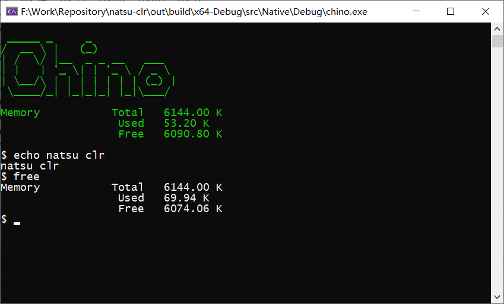

natsu-clr
===

## Introduction
## 简介

`natsu-clr` is an il2cpp transpiler and runtime compatible with .Net Core.
`natsu-clr` 是一个兼容 .Net Core 的 IL2CPP 编译器和运行时。

## Features
- .Net Core 3.0 compatible
- Small memory footprint
- Very portable
- Easy to interop with C++
- Compile-time vtable and variable initializer
- Assembly-level compile without a full build of programs

## 特性
- .Net Core 3.0 兼容
- 极小内存占用
- 可移植性强
- 很容易和 C++ 互操作
- 编译期虚表和变量初始化
- 程序集级别编译，不需要整个程序全部编译

## Supported CLR Features
## 支持的 CLR 特性
- Array
- Span
- Delegate
- Unsafe
- Internal Call
- Unicode
- Volatile and Interlocked
- Thread

## Roadmap
- [ ] Full support of standard libraries (Wellcome contributors!)

## 路线图
- [ ] 完整支持标准库 (欢迎贡献者！)